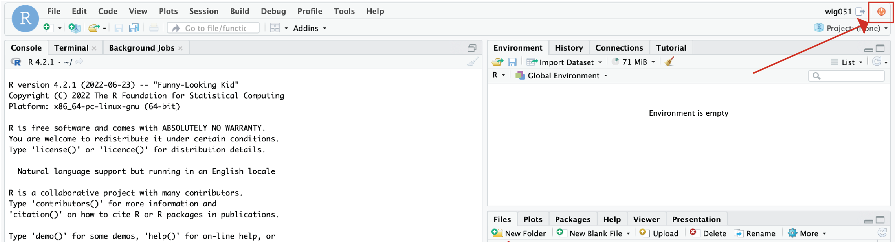

Approximate time: 45 minutes

## Learning Objectives:

- Opening RStudio environment on O2
- Running an R Script on the O2 cluster on the command-line

## RStudio on the O2 Portal

The [O2 Portal](https://o2portal.rc.hms.harvard.edu/pun/sys/dashboard) provides an opportunity for researchers to leverage the resources of a computing cluster while maintain the interactive nature of an RStudio environment. 

## Creating an RStudio session

As we create our RStudio session, we are going to be monitoring what is happening with our account on O2 in real-time. In order to do this, we will need to log into O2:

```
ssh <your_O2_account>@o2.hms.harvard.edu
```
Next, open an interactive job so that we can get off of a login node.

```
srun --pty -p interactive -t 0-02:00 --mem 1G /bin/bash
```

### View our current jobs

Before we get started with creating an RStudio session on O2, let's first look at the jobs we have running on O2 using the `squeue` command. This will show our currently running jobs:

```
squeue -u $USER
```

<p align="center">

</p>


> NOTE: The `-u` option allows the use to specify the user to return from the `squeue` command and $USER is a special variable with your username.

We can see that we currently have 1 interactive job currently running. We will continue to monitor our jobs using the `watch` function. The `watch` command will re-run the command that follows periodically so that we can "watch" the progress of the command and it will feel like it will be updating in real-time. The default is for it to update every two seconds.

```
watch squeue -u $USER
```

### Selecting the Resources for RStudio

Now we can request the resources that we need for RStudio. In order to do this, we will need to open up our web browser and go to:

https://o2portal.rc.hms.harvard.edu

At the top ribbon of the webpage we can select the `HMS-RC Applications` tab and a dropdown menu will appear. From this dropdown menu, select `RStudio Environment`. 

<p align="center">

</p>

At this point, you may be asked to provide you Harvard Key credentials and carry out Duo two-factor authentication. Now we are on a page where we can request resources for our RStudio environment. We need to request the partition, number of cores, wall time and memory. Because this is just an example, we are just going to use the `short` partition, a single core, an hour of wall time and 1 GB of memory.

<p align="center">

</p>

### loading modules?

Once we have requested those resources, we can also click checkboxes to make certain data storage are availuble to us. Once we have selected any additional data storage we want access to, we can click "Launch" at the bottom. 

<p align="center">

</p>

We can now see that our job is queued in our `sbatch` command on the terminal and the Job ID matches the number in the parantheses in our browser (in red below). Initially, our job will be slated as queued which is also shown in the browser window and in the terminal (in orange below). 

<p align="center">

</p>

Once the resources for our job have been allocated, the job will have started, regardless of whether we have clicked "Connect to RStudio Server" to open up RStudio in our browser. Once again, you can see the correspondence between the browser and terminal for Job ID (in red below), status (in orange below), compute node (in purple below) and wall time (in pink).

<p align="center">

</p>

We can start our RStudio environment by click on the "Connect to RStudio Server" button. An RStudio window should now open up in your browser and you can use it just like RStudio on your laptop, except now you have access to the resources of an HPC.

### Open up the script in RStudio

Now let's make some edits to our R script, `sqrt_input.R`, in the browser. Let's change:

```
round(sqrt(num), digit=2) 
```

To be to add two to our output of the round squeare root:

```
round(sqrt(num), digit=2) + 2
```

We can save these changes and look at our Rscript in the terminal:

```
less sqrt_input.R
```

Now we can see that our edits are reflected in the R Script.

## RStudio Environments are not persistent across sessions

Let's assign a few variables:

```
x <- 2
y <- 3
z <- x + y
```

Now let's go ahead and close our RStudio session by clicking the red button in the upper right of the session.

<p align="center">

</p>

Once we have closed the RStudio session, we will have an option to reopen it. When we reopen it, you will notice that it is the  environment has been wiped clean. That is because the environment is not saved when closing an RStudio session. In order to save the environment, you will need to use the `save.image()` function in R. Let's once again, assign a few variables:

```
x <- 2
y <- 3
z <- x + y
```

But this time, before you close our RStudio session, let's go ahead and save the environment using the `save.image()` function:

```
save.image()
```

Now, our environment is saved by default to a hidden file `.RData` in our Home directory. However, we can save it to a specific directory, such as our `R_workshop` directory by providing the path to this directory. Let's make our environment a bit different so that we can differentiate the two `.RData` environments.

```
a <- 1
```

Now let's save this `.RData` object to out `R_workshop` directory:

```
save.image("~/R_workshop/.RData")
```

Now let's close our RStudio session and re-open it. We will notice that by default RStudio is reading the `.RData` image from our home directory, because the `a` variable is not in the environment. However, if you want to load the `.RData` image from our `R_workshop` directory, then we can use the following command:

```
load("~/R_workshop/.RData")
```

Now we can see that our `a` variable is present. 

## export PATH to personal libraries?

## Advantages of the portal

Advantages to using RStudio on the O2 Portal are:
- Allows for the use of high memory nodes
- Allows for multithreading jobs
- Has access to the large datasets that might be stored on an HPCC
- Allows for using the RStudio IDE on a HPCC

Disadvantage using RStudio on the O2 Portal:
- If you want to carry out time-consuming calculations, it is likely still best to submit those as a RScript via `sbatch` like we did in the previous class as you will need to keep the connection open on your coputer for the entirety of the analysis

***
*This lesson has been developed by members of the teaching team at the [Harvard Chan Bioinformatics Core (HBC)](http://bioinformatics.sph.harvard.edu/). These are open access materials distributed under the terms of the [Creative Commons Attribution license](https://creativecommons.org/licenses/by/4.0/) (CC BY 4.0), which permits unrestricted use, distribution, and reproduction in any medium, provided the original author and source are credited.*
