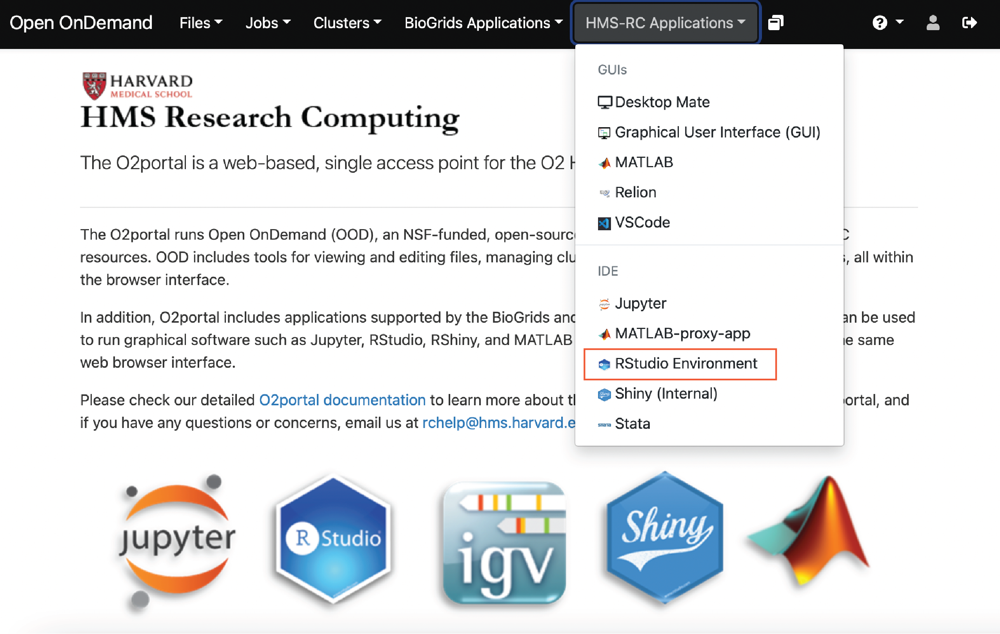
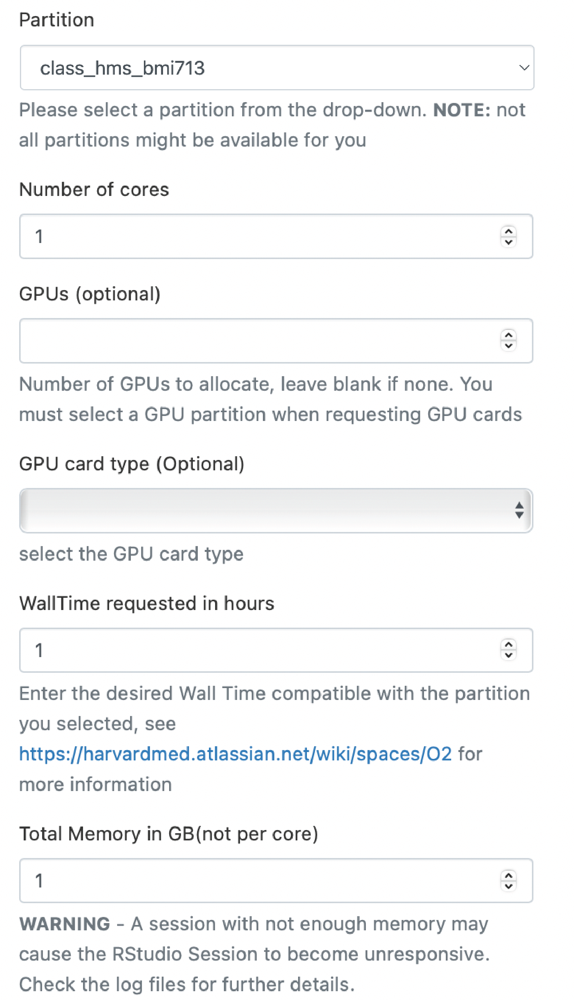
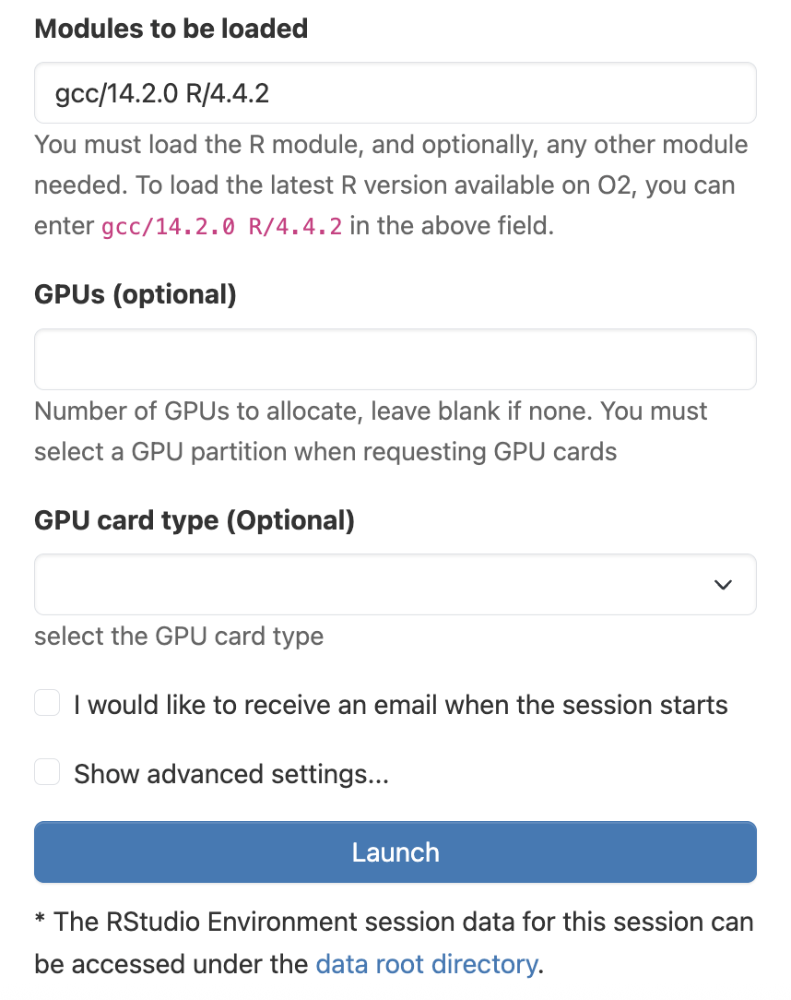
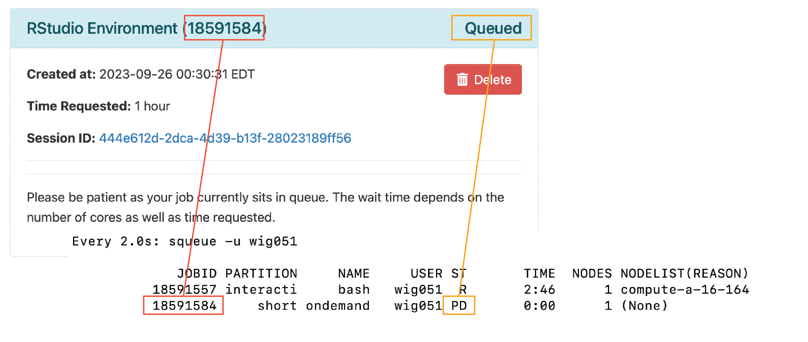
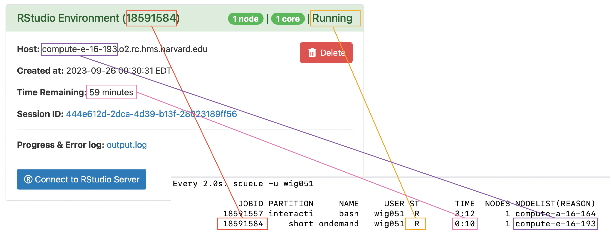

Approximate time: 45 minutes

## Learning Objectives:

- Opening RStudio environment on O2
- Running an R Script on the O2 cluster on the command-line

## RStudio on the O2 Portal

The [O2 Portal](https://o2portal.rc.hms.harvard.edu/pun/sys/dashboard) provides an opportunity for researchers to leverage the resources of a computing cluster while maintain the interactive nature of an RStudio environment. 

## Creating an RStudio session

As we create our RStudio session, we are going to be monitoring what is happening with our account on O2 in real-time. In order to do this, we will need to log into O2:

```
ssh <your_O2_account>@o2.hms.harvard.edu
```
Next, open an interactive job so that we can get off of a login node.

```
srun --pty -p interactive -t 0-02:00 --mem 1G /bin/bash
```

### View our current jobs

Before we get started with creating an RStudio session on O2, let's first look at the jobs we have running on O2 using the `squeue` command. This will show our currently running jobs:

```
squeue -u $USER
```

<p align="center">

</p>


> NOTE: The `-u` option allows the use to specify the user to return from the `squeue` command and $USER is a special variable with your username.

We can see that we currently have 1 interactive job currently running. We will continue to monitor our jobs using the `watch` function. The `watch` command will re-run the command that follows periodically so that we can "watch" the progress of the command and it will feel like it will be updating in real-time. The default is for it to update every two seconds.

```
watch squeue -u $USER
```

### Selecting the Resources for RStudio

Now we can request the resources that we need for RStudio. In order to do this, we will need to open up our web browser and go to:

https://o2portal.rc.hms.harvard.edu

At the top ribbon of the webpage we can select the `HMS-RC Applications` tab and a dropdown menu will appear. From this dropdown menu, select `RStudio Environment`. 

<p align="center">

</p>

At this point, you may be asked to provide you Harvard Key credentials and carry out Duo two-factor authentication. Now we are on a page where we can request resources for our RStudio environment. We need to request the partition, number of cores, wall time and memory. Because this is just an example, we are just going to use the `short` partition, a single core, an hour of wall time and 1 GB of memory.

<p align="center">

</p>

### loading modules?

Once we have requested those resources, we can also click checkboxes to make certain data storage are availuble to us. Once we have selected any additional data storage we want access to, we can click "Launch" at the bottom. 

<p align="center">

</p>

We can now see that our job is queued in our `sbatch` command on the terminal and the Job ID matches the number in the parantheses in our browser (in red below). Initially, our job will be slated as queued which is also shown in the browser window and in the terminal (in orange below). 

<p align="center">

</p>

Once the resources for our job have been allocated, the job will have started, regardless of whether we have clicked "Connect to RStudio Server" to open up RStudio in our browser. Once again, you can see the correspondence between the browser and terminal for Job ID (in red below), status (in orange below), compute node (in purple below) and wall time (in pink).

<p align="center">

</p>

We can start our RStudio environment by click on the "Connect to RStudio Server" button. An RStudio window should now open up in your browser and you can use it just like RStudio on your laptop, except now you have access to the resources of an HPC.

### Open up the script in RStudio; make some changes

Now let's make some edits to our R script in the browser. We can save these changes and now let's look at our Rscript in the terminal:

```
less example_script.R
```

Now we can see that our edits are reflected in the R Scripot.

## RStudio Environmnet is persistant

If we choose to close out RStudio environment, we will notice that when we reopen it, it is the same environment that we left.


## Show how to run the script in the terminal tab of RStudio

However, we can also run our script directly in the terminal with R using `Rscript`.

`Rscript example_script.R`

## export PATH to personal libraries?

## Advantages of the portal

Some advantages to using the portal are:
- Allows for the use of high memory nodes
- Allows for multithreading jobs (this can be done in RStudio with some packages right?

Advantages to using RScript
- Allows for long computations to be carried without be concerned about closing R session
